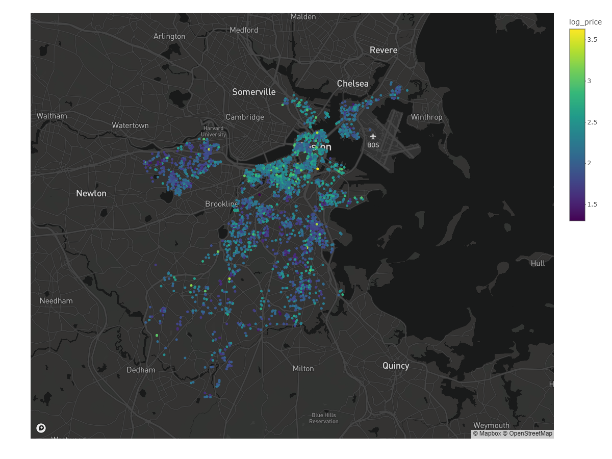
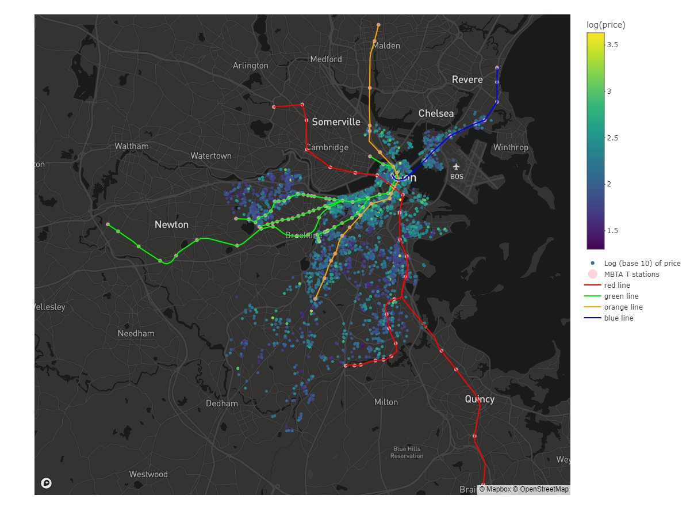
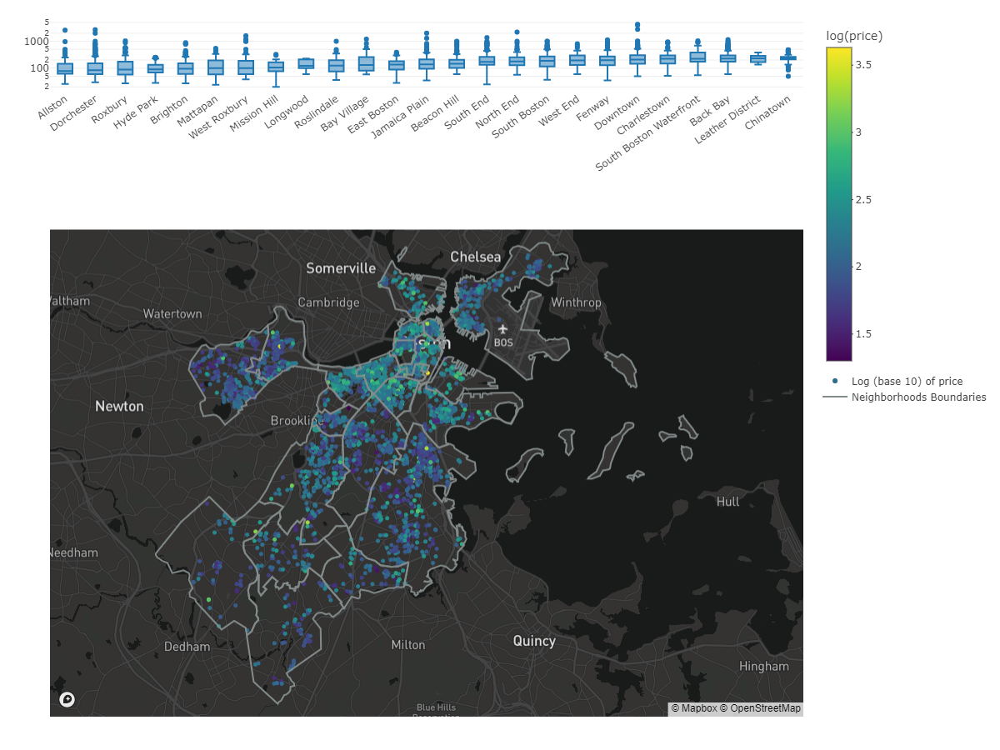
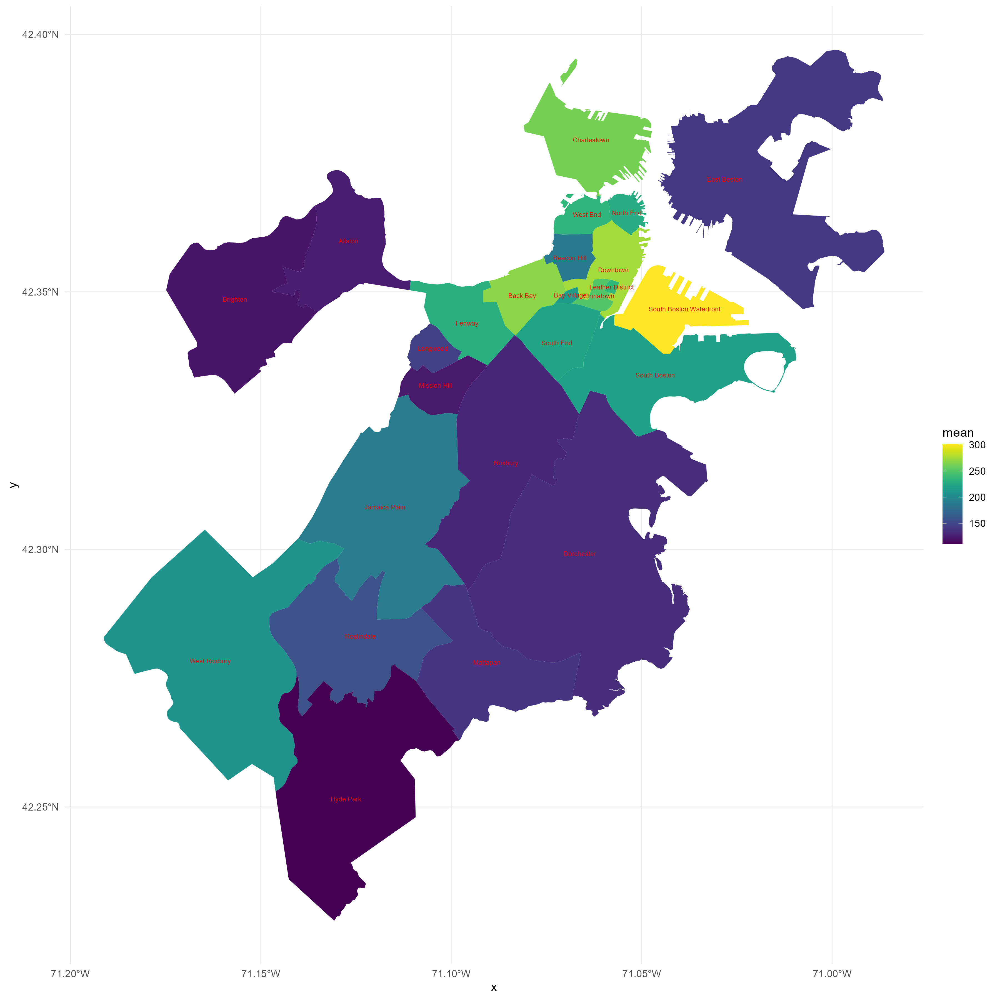
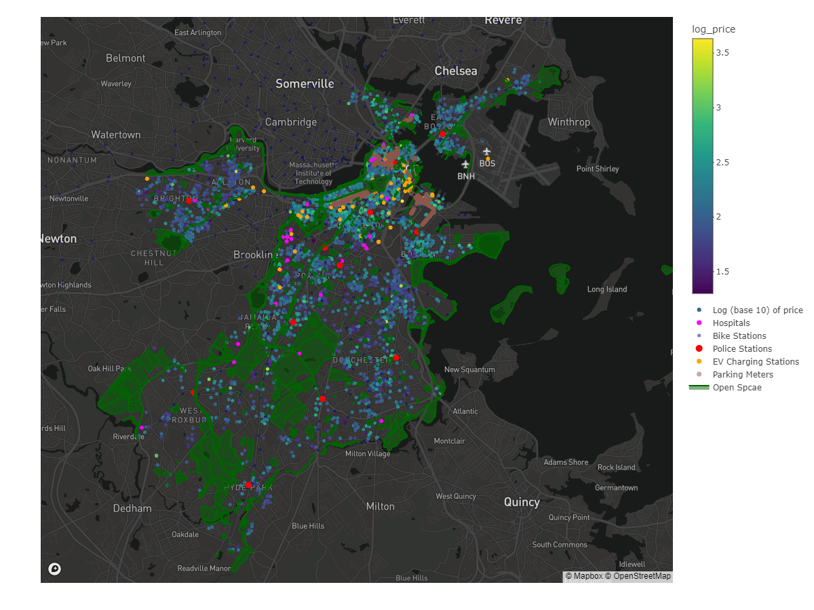

# Boston Airbnb Listings

The objective of this project was to create an interactive application that provides users with various information about AirBnB listings in the Boston area. The app allows users to filter listings by price range and room type, and choose different features they want to visualize on the map such as hospitals, police stations, bike stations, EV charging stations, and parking meters. In addition, the application provides an option to select and highlight different neighborhoods and public transit lines, allowing users to explore the city's infrastructure in relation to the AirBnB listings. The project was coded using R within Rstudio.

- **EDA**: Rmarkdown Exploratory data analysis with visualizations can be found here: [EDA](./2023_eda.Rmd)
- **Report**: A more detailed Rmarkdown report of the maps can be found here: [Report](./2023_maps.Rmd)

## Shiny App

The [Shiny app](https://connoraking.shinyapps.io/boston_listings_app/) was hosted on shinyapps.io

## Table of Contents

1. [Introduction](#introduction)
    - [Project Overiew](#project-overview)
    - [Tools and Libraries Used](#tools-and-libaries-used)
    - [Data Acquisition](#data-acquisition)
2. [Data Cleaning and Pre-processing](#data-cleaning-and-pre-processing)
3. [Map and Geospatial Analysis](maps-and-geospatial-analysis)
    - [Map with Listings](#map-with-listings)
    - [Maps with T stations and T lines](#map-with-t-stations-and-t-lines)
    - [Map with Neighborhood Boundaries](#map-with-neighborhood-boundaries)
    - [Choropleth Map](#choropleth-map)
    - [Map with Additional Features](#map-with-additional-features)
4. [Shiny App Development](#shiny-app-development)

## Introduction

### Project Overview

This project serves as a demonstration of my proficiency in R programming, data analysis, and geospatial visualization. I have designed and developed an interactive tool using R and the Mapbox API that showcases various employment sectors and demographic trends across different geographical locations. The interactive map produced is particularly useful in visualizing and understanding the spatial distribution of these attributes, providing meaningful insights for urban planning, policy-making, and resource allocation decisions.

### Tools and Libaries Used

In the course of this project, I've applied extensive use of various R libraries:

- **Data Manipulation**: `tidyverse`
- **Geospatial Analysis**: `sf`, `tmaptools`
- **Data Visualization**: `plotly`, `ggplot2`, `viridis`
- **Shiny App Development**: `shiny`, `shinyWidgets`
- **Map Rendering**: `mapboxapi`

### Data Acquisition

- Listings (March 19th 2023): [Inside Airbnb](http://insideairbnb.com/get-the-data/)
- MBTA data: [Erik Demaine](http://erikdemaine.org/maps/mbta/)
- Neighborhood Lines: [Boston Maps](https://data.boston.gov/dataset/boston-neighborhoods) 
- Hospitals: [Boston Maps](https://data.boston.gov/dataset/hospitals)
- Police Stations: [Boston Maps](https://data.boston.gov/dataset/boston-police-stations) 
- Bluebike Stations: [Boston Maps](https://data.boston.gov/dataset/blue-bike-stations)
- EV Charging Stations: [Boston Maps](https://data.boston.gov/dataset/charging-stations)
- Parking Meters: [Boston Maps](https://data.boston.gov/dataset/parking-meters)
- Recreational Spaces: [Boston Maps](https://data.boston.gov/dataset/open-space)

## Data Cleaning and Pre-processing

- Listings valued at $0 or outliers deemed to be errors were removed. 
- The `grepl` package was used to parse MBTA stations and subway lines.
- The `meters` data set was wrangled from a single `str` column named `PAY_POLICY` into columns `pay_time`, `pay_days`, `pay_rate`, and `pay_duration`. These new columns were then used in the tooltip for the associated markers.

## Maps and Geospatial Analysis

Since GitHub's Markdown rendering does not support intreactive content directly, I cannot embed the the interactive maps into the document. Instead I will embedd png files for the maps. As a limitation, you won't be able to see the tooltips for each marker. Please check out the [Shiny app](https://connoraking.shinyapps.io/boston_listings_app/) I created which includes all features and interactivity.

### Map with Listings
<!-- -->

This map visualizes the geographic distribution of listings with their price represented in color (on a logarithmic scale). The logarithmic scale helps visualize a wide range of prices. The tooltip provides more details about each listing when hovered over the marker. 

### Map with T stations and T lines

<!-- -->

This map includes T (subway) stations and lines. The color-coded lines represent different subway routes, helping to visualize public transportation accessibility for each listing. I created a function to add an `add_sf` layer. The `grepl` function was used to filter the colors because the colors had multiple different observations within the dataset that was converted into `sf` from `GPX`. For example there is *Red Line (main)*, *Red Line (Mattapan)*, etc. 

    
     

Comparing the official subway map with our map with the subway lines added, we can clearly see that the official map distorts the lines. The official map distorts the lines for a variety of reasons, mostly related to the goal of clarity, readability, and simplicity for the user. 

### Map with Neighborhood Boundaries

<!-- -->

This map displays neighborhood boundaries to provide a clear delineation of different areas within Boston. It also includes a side-by-side boxplot for each neighborhood. The boxplot is ordered in ascending value for the median price of each neighborhood.

### Choropleth Map

<!-- -->

This map displays the average listing price for each neighborhood. This visualization helps to identify the more expensive and cheaper neighborhoods in Boston. The visualization of mean prices can potentially serve as a proxy for the median household income for each neighborhood as they seem to be correlated with real life context.

### Map with Additional Features

<!-- -->

- Within this map we added new markers for police stations, hospitals, Bluebike stations (a bicycle sharing system), electric vehicle charging stations, parking meters, and polygons for open/recreational spaces. 
- The tooltip for the police stations includes the address.
- The tooltip for hospitals includes the name and address.
- The tooltip for Bluebike stations includes the station number, address, and total docks.
- The tooltip for the EV charging stations includes the station name, address, EV network and EV connector.

## Shiny App Development

The interactive map and aforementioned visualizations were encapsulated into a Shiny app. This app allows users to adjust various parameters and observe the immediate impact on the map. The UI features a slider input for price, a check box input for minimum nights, subway line and room type, and then a picker input for map features and neighborhood. Selecting a certain input filters the listings to the appropriate neighborhoods and a corresponding boxplot is formed. The boxplot displayed in the lower left corner is the same boxplot design mentioned in the neighborhood map above. 

### Analysis 

Using the [Shiny app](https://connoraking.shinyapps.io/boston_listings_app/) was hosted on shinyapps.io, there I have made a few key observations.

- The most expensive listings are among the intersections of the subway lines
- Hotel room listings are almost entirely consisted within Downtown.
- There are more hospitals around the more expensive listings. There seems to be a significant lack of neighborhoods within the poorer areas of Boston. Noticeably the neighborhoods of Hyde Park, Mattapan, and Dorchester.
- Police Stations seemed to be evenly spread amongst all of the neighborhoods regardless of listing price.
- EV charging stations are nearly exclusively featured amongst the most expensive listings located near Downtown.
- Only a handful of streets from the data (primarily downtown) contain parking meters.
- The network of Bluebike stations seems to be organically laid out (seemingly equidistant from each other), however, there are definitely more concentrated near downtown Boston.
- There are less open spaces near the more expensive listings (more urbanized).

